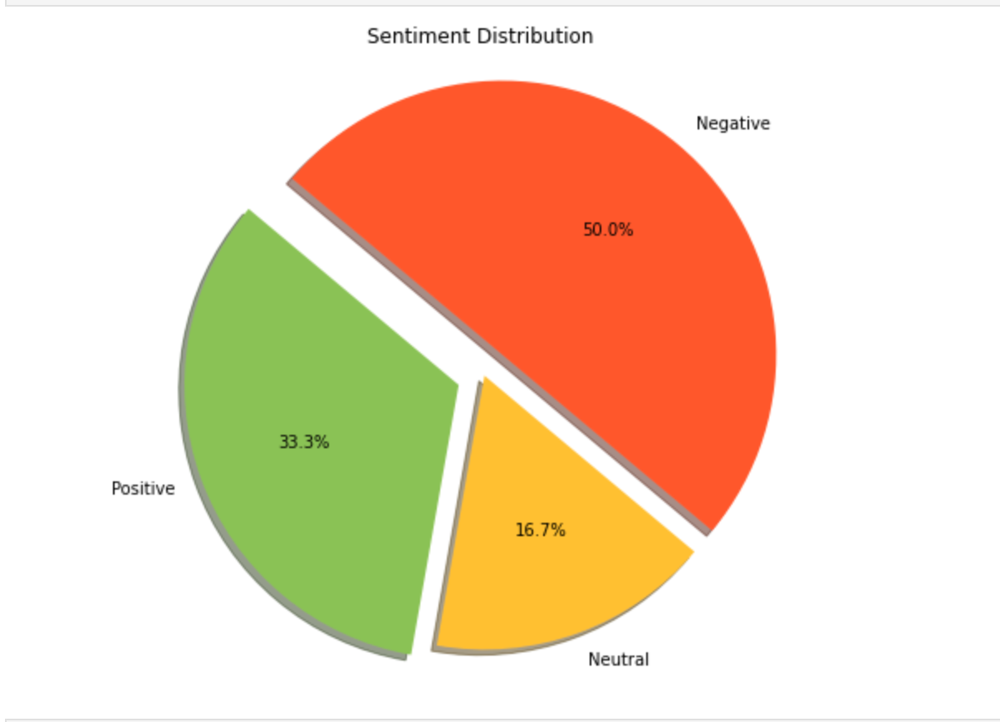
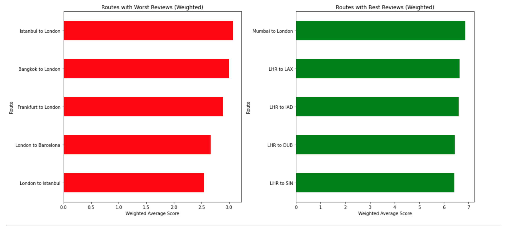
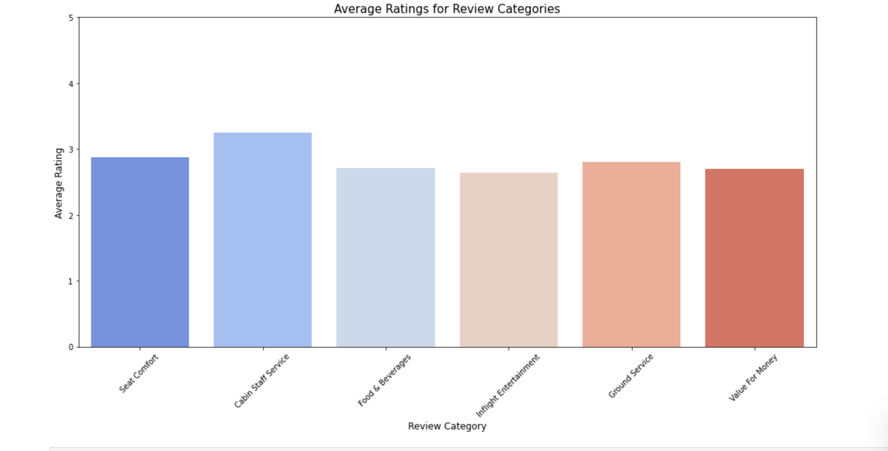
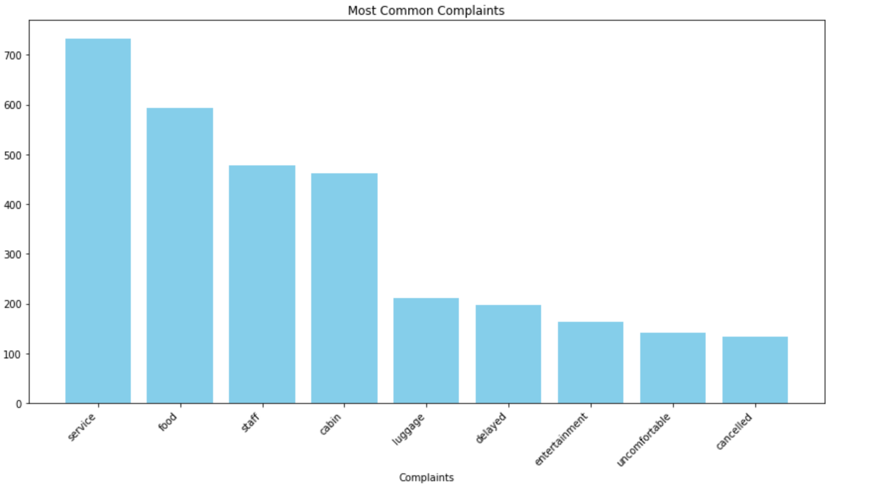

# British Airways Customer Review Analysis

This project analyzes customer reviews for British Airways using data from www.airlinequality.com. By inspecting different aspects of these reviews, the aim is to unearth patterns and trends that affect customer satisfaction. These patterns can guide British Airways in formulating strategies to enhance customer experience.

## Table of Contents:
- [Introduction](#introduction)
- [Data Collection](#data-collection)
- [Data Analysis](#data-analysis)
  - [Sentiment Analysis](#sentiment-analysis)
  - [Bayesian Weighted Average](#bayesian-weighted-average)
  - [Review Categories Analysis](#review-categories-analysis)
  - [Key Complaint Areas](#key-complaint-areas)
- [Visualization](#visualization)
- [Conclusion](#conclusion)

## Introduction

Air travel reviews are invaluable for airlines. They provide insights into passengers' experiences, from booking a ticket to disembarking at their destination. This project seeks to quantify these experiences by focusing on several aspects:
- Overall sentiment
- Routes with the highest and lowest scores
- Rating across various service categories
- Key complaints from negative reviews

## Data Collection

Using web scraping techniques, we collect reviews from www.airlinequality.com. Each review provides:
- Reviewer name
- Review date
- Overall score
- Review content
- Type of traveller
- Seat type
- Route
- Date flown
- Ratings in categories such as:
  - Seat Comfort
  - Cabin Staff Service
  - Food & Beverages
  - Inflight Entertainment
  - Ground Service
  - Value For Money

## Data Analysis

### Sentiment Analysis

Using the TextBlob library, each review's sentiment is gauged. This categorizes reviews as:
- Positive
- Neutral
- Negative

This pie chart showcases the distribution of these sentiments.

### Bayesian Weighted Average

Routes are rated based on a Bayesian weighted average to provide a more balanced view. The idea is to consider both the average score of a route and the number of reviews it has.

### Review Categories Analysis

Each review contains ratings for different service categories. This bar chart illustrates the average ratings for each category, offering a broad overview of British Airways' performance in specific areas.

### Key Complaint Areas

By analyzing words in negative reviews, we identify recurring themes. These themes highlight areas where British Airways might need to focus its efforts.

## Visualization

This project extensively uses `matplotlib` and `seaborn` libraries for visualization. These graphs help:
- Quickly grasp the overall sentiment of reviews.
- Recognize areas of excellence and potential improvement.
- Understand trends in customer satisfaction based on routes and service categories.

## Conclusion

Through this project, British Airways can acquire a comprehensive understanding of its customer reviews. The insights obtained can be foundational for enhancing customer satisfaction and service quality.

**Note:** For reproducing the results, make sure you have all the necessary libraries installed and access to the data source.

**Dependencies:** `requests`, `BeautifulSoup`, `csv`, `TextBlob`, `pandas`, `matplotlib`, `seaborn`, `nltk`

**Acknowledgment:** This project sources its data from www.airlinequality.com, and the analysis is intended for educational purposes.
